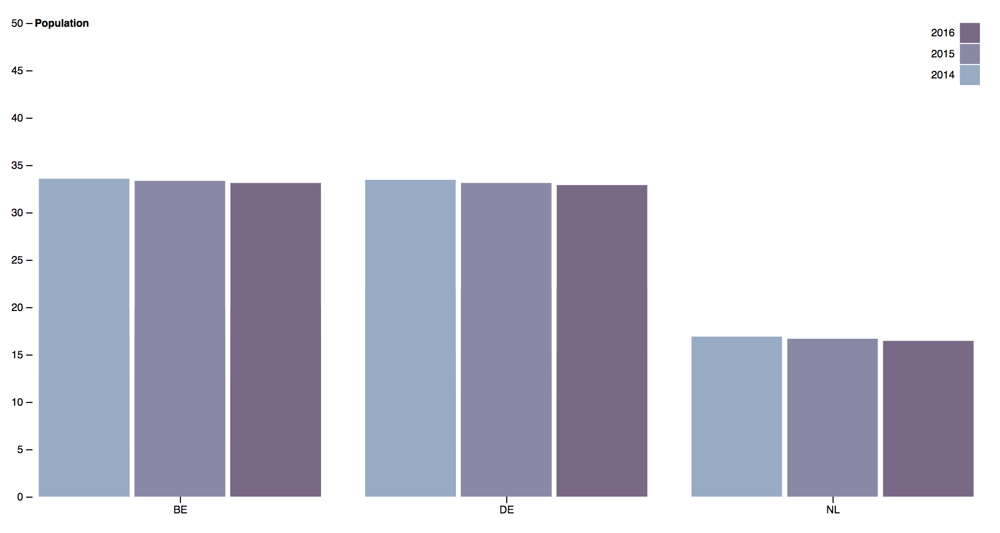

# Assessment 2

## Github Page
Dataset: https://data.europa.eu/euodp/en/data/dataset/WUhuriZldIxgoxTJICVELw

## Beschrijving
Vanuit deze opdracht moesten we dirty data schoon maken.

## Background
Ik heb voornamelijk mijn data opgeruimd met [replace](https://developer.mozilla.org/en-US/docs/Web/JavaScript/Reference/Global_Objects/String/replace) hier word er gebruikt gemaakt van [regular expressions](https://developer.mozilla.org/en-US/docs/Web/JavaScript/Guide/Regular_Expressions)

## Stappen die ik heb genomen
Eerst moest ik kijken wat er precies mis was met mijn data.
Ik heb voornamlijk stack overflow gebruikt en MDN om mij te helpen.
[stackoverflow](https://stackoverflow.com/)
[regular expressions](https://developer.mozilla.org/en-US/docs/Web/JavaScript/Guide/Regular_Expressions)

```
d3.text("tps00010.tsv", function (error, data) {
    if (error) throw error;

    // maakt de data schoon
    data = data.replace(/\t/g, ',')
    data = data.replace(/ +/g, '')
    data = data.replace(/b/g, '')
    data = data.replace(/p/g, '')
    data = data.replace(/e/g, '')
    data = data.replace('go\\tim','country')

    var dataCleaned = d3.csvParse(data, map)

```

### Map de data
Nadat ik mijn data heb schoon gemaakt moest ik een keuze maken
in welke data ik wil laten zien. Ik heb een paar populaties uitgekozen.
```
function map(d) {
    if(d.indic_d === "PC_Y0_14" && d.country === "NL"
      || d.country === "BE"
      || d.country ==="DE"){
      return d;
    }

};
```
### Structuur opbouw
Dit is het structuur waar ik mij aan gehouden heb.
```
var keys = keyData;

// zet de  keys op de juiste plek.
x1.domain(keys).rangeRound([0, x0.bandwidth()]);  // https://github.com/d3/d3-scale#band_rangeRound
y.domain([0,50]) //.nice rond extreme nummers af - https://stackoverflow.com/questions/34930763/what-is-the-logic-behind-d3-js-nice-ticks

// maakt groepen aan.
g.append("g")
    //selecteerd alle "g's"
    .selectAll("g")
    // selecteerd de data
    .data(dataCleaned)
    // creeert elementen
    .enter()
    .append("g") //Maakt g elementen, elk met eigen data
    .attr("transform", function (d) {
        return "translate(" + x0(d.country) + ",0)";
    })
    .selectAll("rect")
    // zorgt ervoor dat de keys en values op de juiste plek staan voor de bars
    .data(function (d) {
        return keys.map(function (key) {
            return {
                key: key,
                value: d[key]
            };
        });
    })
    //maakt een rectangle aan
    .enter().append("rect")
    .attr("x", function (d) {// zorgt dat de x waardes worden meegegeven
        return x1(d.key);
    })
    // voegt data numb toe met een waarden
    .attr('data-numb', function(d){return d.value})
    .attr("y", function (d) { //op de y as begint de rect
        return y(d.value);
    })
    .attr("width", x1.bandwidth()) // kijkt naar de bandwidth en maakt aan de hand daarvan zijn width.
    .attr("height", function (d) {
        return height - y(d.value); //hoogte van de bar wordt de grootte van de value en het wordt niet boven geplaatst
    })
    .attr("fill", function (d) {
        return z(d.key); //krijgt een kleur uit de z variabel
    });

// zet de waardes van de landen op de juiste plek
g.append("g")
    .attr("class", "axis")
    .attr("transform", "translate(0," + height + ")")
    .call(d3.axisBottom(x0));

// text
g.append("g")
    .attr("class", "axis")
    .call(d3.axisLeft(y).ticks(null, "s")) //aantal stappen die het maakt op de y as
    .append("text")
    .attr("x", 2) //locatie tekst x as
    .attr("y", y(y.ticks().pop()) + 0.5) //locatie tekst y as
    .attr("dy", "0.32em")
    .attr("fill", "#000")
    .attr("font-weight", "bold")
    .attr("text-anchor", "start")
    .text("Population");

// maakt de legenda's aan.
var legend = g.append("g")
    .attr("font-family", "sans-serif")
    .attr("font-size", 10)
    .attr("text-anchor", "end")
    .selectAll("g")
    .data(keys.slice().reverse())
    .enter().append("g")
    .attr("transform", function (d, i) {
        return "translate(0," + i * 20 + ")";
    });

legend.append("rect")
    .attr("x", width - 19)
    .attr("width", 19)
    .attr("height", 19)
    .attr("fill", z);

legend.append("text")
    .attr("x", width - 24)
    .attr("y", 9.5)
    .attr("dy", "0.32em")
    .text(function (d) {
        return d;
    });
```


## Dataset
| Countries        | 2014           | 2015           | 2016           |
| NL            | 16.9           | 16.7           | 16.5           |
| DE            | 10.8           | 10.7           | 10.7           |
| BE            | 33.6           | 33.3           | 33.1           |

## License
MIT

## Features
* [scaleBand](https://github.com/d3/d3-scale/blob/master/README.md#scaleBand)
* [rangeRound](https://github.com/d3/d3-scale#band_rangeRound) -
* [data binding](http://alignedleft.com/tutorials/d3/binding-data )
* [domain](https://github.com/d3/d3-scale/blob/master/README.md#quantize_domain)
* [range](https://github.com/d3/d3-scale/blob/master/README.md#quantize_range)
* [ticks](https://github.com/d3/d3-scale/blob/master/README.md#quantize_ticks)
* [scaleOrdinal](https://github.com/d3/d3-scale/blob/master/README.md#scaleOrdinal)
